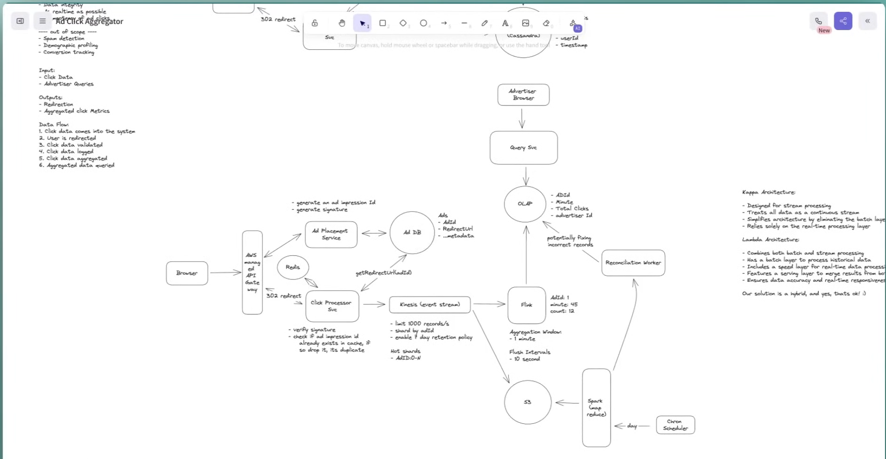

############################################################################# Infra Design #########################################################################################################

Ad Click Aggregator is a system that collects & aggregated data on ad clicks.
It is used by advertisers to track the performance of their ads & optimize their campaigns.
These are ads displayed on website or app like Facebook

# FR
    Users click an ad anf get redirecterd to the advertisers website
    Advertisers can query click metrics over time w/ 1 min granularity

    ----- out of scope ------
    Ad target & serving
    Cross Device Tracking
    Integration with offline channels

# NFR
    Scalable to support peak 10k ClicksPS
    Low Latency in analytics query < 1s
    Fault Tolerance (we do not want to loose clicks and click data is accurate)
    Data Integrity (clicks data is upto date)
    As realtime as possible
    Idempotency of ad clicks (avoid duplicate / spam)

    ------------ out of scope ------------
    Spam detection
    Demographic profiling
    Conversion tracking

# Estimations
10M ads at given time
10K ad clicks per second

### QPS
### Storage
### N/w bandwidth

# Entities
    Ads
        id
        redirectUrl
        ...metadata
    
    ClickEvents
        eventId
        adId
        userid
        timestamp
    
    total_clicks_minute
        adId
        minute
        totalClicks
        advertiserId

# APIs
/api/v1/ad/click
Response -> 302

/api/v1/ad/query?
Response -> Aggregated clicks metrics

# Data Flow
1. Click data received
2. User is redirected
3. Click data validated
4. Click data  logged
5. Click data aggregated
6. Aggregated data queries

# Idempotency
#### Ad impression
Generate a **signedAdImpressionId**

# Design
## Components
1. Client: Browser
2. API Gateway - LB, Rate Limiting, Routing, Auth, SSl Termination, IP/Domain Whitelisting, CORS, Keep Alive connection
3. Ad Placement SVC (Ad DB (Ads{id, redirectUrl,...metadata}))
4. Click Processor SVC (Redis {adImpressionId::userId=true}), Click DB (Apache Cassandra))
5. Kafka (Event stream) {PartitionKey: AdId::0-N} , limit 1000 records / sec,  day retention
6. Stream aggregator (Flink {AdId: 1, minute; 45, count: <12>}, Aggregation Window=1min, FlushIntervals=10secs)
7. S3 (event dump)
8. MapReduce (Transformation ? Aggregation Jobs)
9. Cron Scheduler (hourly, daily, weekly, monthly)
10. Reconciliation Worker
11. Query SVC (OLAP (Amazon Redshift))

## Flow
