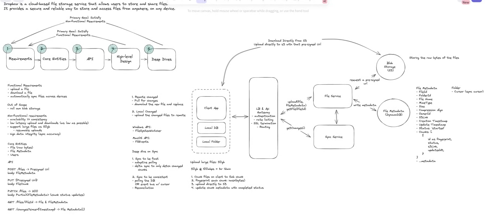

# FR
    upload files
    download files
    automatically sync files across devices

    ------ out of scope -------
    own blob storage 

# NFR
    availability >> consistency
    low latency upload & downloads (as low as possible)
    support large files as 50GB
        - resumable uploads
    high data integrity (sync accuracy)


# Estimations
#### QPS
#### Storage
#### N/w bandwidth


# Entities
    File (raw bytes)
    FileMetadata
        id
        directoryId
        name
        mimeType
        size
        ownerId
        createdAt
        updatedAt
        status
        chunks[
            {
                id as fingerprint
                checksum
                status
                s3Link
                updatedAt
            }
        ]
        s3link
         ..metadata
    Directry
        cursor (sync cursor)
    Users

# APIs
    POST /api/v1/files -> 200, PresignedURL
    header: JWS/session token
    body: File Metadata

    PUT {PresignedURL}
    body: FileChunk

    PATCH /files -> 200
    body: Partial<FileMetadata> (chunk status updates)
    
    GET /api/v1/files/:fileId ->? File & FileMetadata
    GET /api/v1/files/changes/since={timstamp} -> FileMetadata[]


# Design
## Components
1. Client: Device (has[Client App (Local Db(sqlite)), Local Folder])
2. API Gateway - LB, Rate Limiting, Routing, Auth, SSl Termination, IP/Domain Whitelisting, CORS, Keep Alive connection
3. Blob Storage(S3 | S3 multi-part upload)
4. File svc (FileMetadata DB (DynamoDB))
5. Event Bus (Kafka PK: userId, directoryId)
5. Sync svc  

#### Client
1. Remote Changed
   - Pull for changes
   - download the new file & replace
2. Local changed
   - upload changed files to remote 
   - Windows
     - FileSystemWatcher APi
   - Mac
     - FSEvents
   - Linux
     - inotify
        ```bash
          inotifywait -m /path -e create -e moved_to --include '.*' |
              while read -r directory action file; do
                  # Do your thing here!
                  done 
       ```
     - Split
       ```bash
         split --bytes=1000M 6GB 6GB.part.
       ```
    - Combine
       ```bash
          cat 6GB.part.* > 6GB.combined
       ```
3. Compression 
   - based on file type
   - algo: snappy, ...

### Sync
1. Fast
   - Adaptive polling
     - For Dropbox, we can use a hybrid approach. We can classify files into two categories:
       **Fresh files**: Files that have been recently edited (within the last few hours). For these, we maintain a WebSocket connection to ensure near real-time sync.
       **Stale files**: Files that haven't been modified in a while. For these, we can fall back to periodic polling since immediate updates are less critical.
   - Delta sync to only fetch changed chunks
2. Consistent
    - polling the Db
    - or event bus with cursor
    - Reconciliation (Client app fetches everything weekly, monthly)

## CDN
- Expensive
- Not useful as user is close Data center
- good for highly shared file
- good for global users

## Flow
