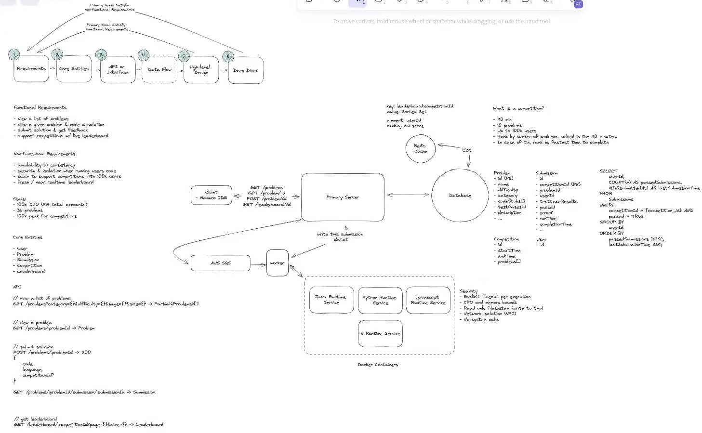

# FR
    view a list of problems
    view a given problem & code a solution
    submit solution & feedback
    support competitions w/ live leaderboard
    Competition
        - 90 mins
        - 10 problems
        - upto 100k users
        - Rank by number of problems solved in 90 mins
        - incase of tie, rank by fastest time to cmplete

# NFR
    availabilty >> concistency
    security & isolation when running users code
    scale to support competitions with 100k users
    fresh / near realtime leaderboard

# Estimations
    Total users: 5M
    DAU: 100k
    Problems: 3K
    Peak 100k for competitions 

#### QPS
#### Storage
#### N/qw bandwidth
#### Memory

# Entities
    User
        id
    Problem
        id
        name
        description
        difficulty
        category
        codestubs[]
        testcases[]
    Submission
        id
        problemId
        competitionId
        testCaseResults[]
        passed
        error?
        runTime 
        submittedAt
        userId
        ... metadata
    Competition
        id
        startTime
        endTime
        problemIds[]
    Leaderboard

# API
    GET /api/v1/problems?category={}&difficulty={]&size={}&cursor={} -> Partial<Problem>[]
    GET /api/v1/problems/:problemId -> Problem

    POST /api/v1/problems/:problemId/submission -> Submission
    {
        language
        code (max 10KB)
        competition?
    }

    GET /api/v1/leaderboard/:competitionId?size={}&cursor={} -> Leaderboard

# Design
### Components
1. Client: Monaco IDE
2. API Gateway - LB, Rate Limiting, Routing, Auth, SSl Termination, IP/Domain Whitelisting, CORS, Keep Alive connection
3. Problem svc (Problem DB (Postgres DB))
4. Submission svc 
5. Containers ([Java, Python, Javascript] Runtime svc) or use Serverless functions (issue cold start), 
   Security
    - Explicitly Timeout
    - CPU & Memory bound
    - Read only filesystem (write to /tmp)
    - N/w isolation - vpn
    - NO system calls
6. Leaderboard svc (Redis (TTl 10s), m)

## Flow
