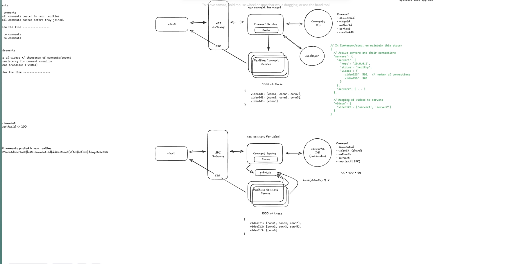

# FR
    Viewer can post comments
    Viewer can see all comments poster in near realtime
    Viewer can see all comments posted before they joined

    ----- out of scope -----
    Viewers can reply to comments
    Viewers can react to comments


# NFR
    Availability >> consistency for comment creation
    Low latency (comment broadcast (~200ms (which is percieved as realtime)))
    scale (to millions of concurrent of videos with thousands of comments per second)

    ----- below the line -----
    Security
    Integrity


# Estimates
    1M videos * 100 comments * 48 =  
#### QPS
#### Storage
#### Bandwidth


# Entities
    Comments
        id
        liveVideoId
        authorId
        content (256)
        idempotencyKey (UK)
        createdAt (Sort key)

    Live video
    User


# API
    POST /api/v1/live/videos/:liveVideoId -> 200
    ```json
    {
        comment
    }
    ```

    GET /api/v1/videos/:VideoId/comments?size={}&cursor={lastcommentId}&direction={prev/next}&last={true/false}
    GET /api/v1/videos/:videoId/comments/subscribe (SSE)
        Keep-alive: 65sec

# Design
#### DataFlow
1. Client: Viewer ([Mobile, Desktop] Browser, Mobile App)
2. API Gateway - LB, Rate Limiting, Routing, Auth, SSl Termination, IP/Domain Whitelisting, CORS, Keep Alive connection
3. etcd (videoId: [serverIds])
4. Comment svc (Redis {userid:videoId: comment[] (TTL: 5 minutes)}, {videoId: comments[500]}), Comment DB (Apache Cassandra))
5. pub/sub (Redis / Confluent kafka (con: viewer subscribe/unsubscribe quickly)) (PK: videoId)
6. Comment Subscribe svc ({video1d: [con1, con2]})


# HLD

