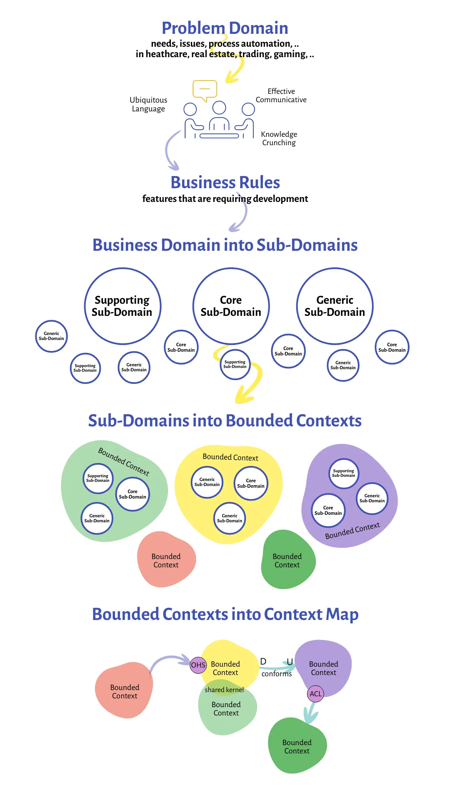

- Defines the overall design of a software system or application, including its architecture, subdomains, relationships, and context maps.
- Strategic design is concerned with identifying the critical subdomains and bounded contexts of a system, understanding their relationships, and determining how they should be organized and integrated to achieve the business goals and objectives of the system.
- The goal of strategic design is to create a cohesive and scalable software architecture that aligns with the business goals and provides a solid foundation for future development and growth.

#### Problem Domain
The problem domain is the specific area of the business that the software system is being developed to address

#### Core (Sub)Domain
- The part of a software system that contains the primary business logic and processes, representing the heart of the application’s functionality.
- It should be well-defined, modular, and maintainable
- In DDD, the core domain is typically encapsulated in a **set of cohesive and loosely-coupled objects**, known as the domain model, which models the business concepts, rules, and processes of the problem domain.

#### Supporting (Sub)Domain
A software system that play a significant role in enhancing and supporting the primary business functionalities.
Example
    - the shopping cart feature might be part of the core domain, a product review system could be a supporting subdomain—integral for enhancing user experience but not a primary business driver.

#### Generic (Sub)Domain
- Handle functionalities common to many types of businesses and industries.
- Due to their standardized nature, the solutions for these subdomains are often outsourced or implemented using off-the-shelf software.
- Examples
  1. Authentication
  2. Email Notifications
  3. Data Logging

