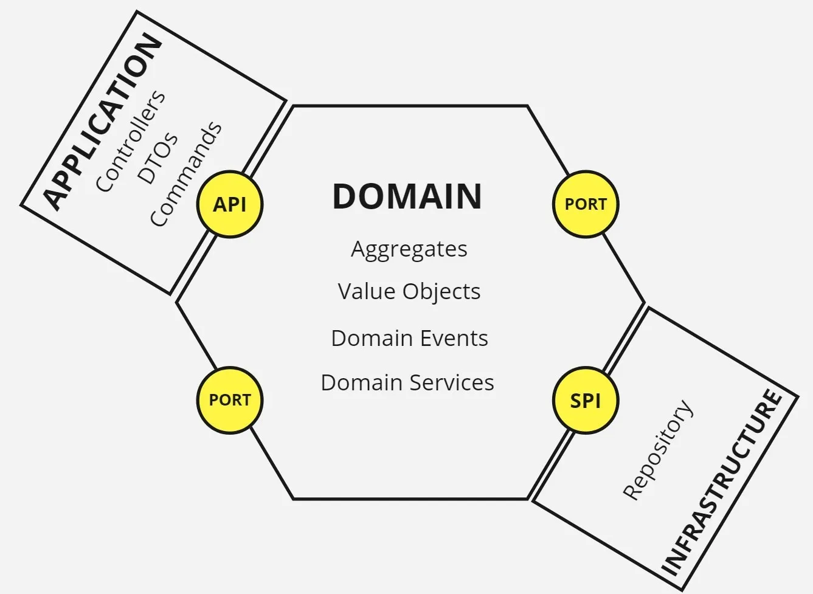

## Layers
1. Domain Layer
    - Will be the holder of aggregates and value objects as well as an implementation of domain services and domain events.
    - The domain layer exposes its ports (API & SPI) to adapters on the application and infrastructure layers.
2. Application Layer
    - contains the inbound adapters like REST controller which uses DTOs and commands as well as it injects the service exposed by API port to talk with domain layer.
3. Infrastructure Layer
    - contains the outbound adapters for a data store such as repository which implements the interface exposed by SPI port to handle CRUD.

