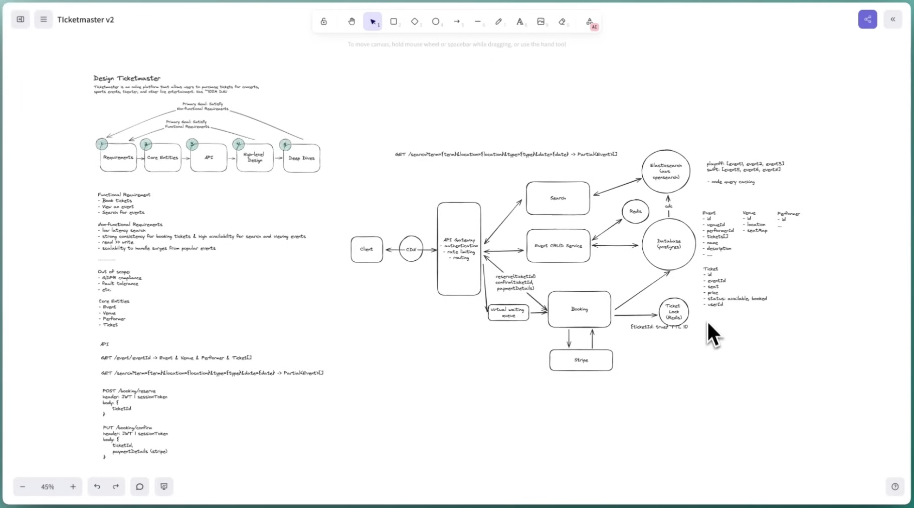

# FR
    Search for events
    View an event
    Book Tickets

# NFR
    Strong consistency for ticket booking & high availability for search & view events
    read >> write
    scalability to handle surges from popular events

# Estimations
## QPS
## Storagfe
## N/w bandwidth

# Entities
    Event
        id
        venueId
        performerId
        name
        description
        city (Partition Key)

    Venue
        id
        location
        city
    Seat
        id
        venueId
        rowNumber
        seatNumber
    Performer
        id
    Ticket
        id
        seatId
        eventId
        price
        status: available, reserved, booked
        reservedTimestamp
        accountId

# API
    GET /api/v1/events/:eventId
        Response -> 
        ```json
        {
            Event
            Venue
            Performer
            Ticket[]
        }```

    GET /api/v1/search/events?size=?&cursor=?&performer=?&location=?&type=?&dateStart=?&dateEnd=? -> Partial<Event>[]

    POST /api/v1/bookings/reserve
        header: JWS SessionToken
        Request: {
            ticketId
        }

    PATCH /api/v1/bookings/confirm
        header: JWS SessionToken
        Request: {
            ticketId
            paymentDetails {}
        }

- Server Sent Events when seat got booked

# Design
## Components
1. Event CRUD SVC (Redis, Postgres)
2. Search SVC (CDN, Redis (Optional), Elasticsearch (Opensearch - node query caching))
3. CDC from Event Postgres to Elaticsearch synchronous)
4. Virtual Waiting Queue (Redis SortedSet on request arrive)
5. Booking SVC (Postgres & Redis (Distributed Lock  (TTL 10 mins)))

