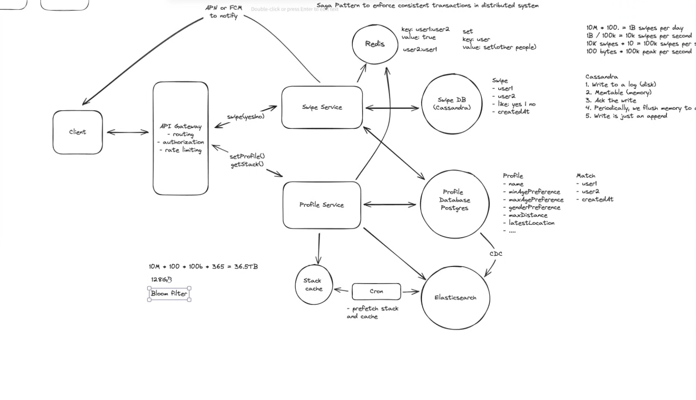

# FR
    users can set their prefrence (age, gender, etc)
    users can view a stack of potential matches
        - match preferences
        - close to current location
    users can swipe left (no) / right (yes)
    2 users swipe right, match -> notification
    
    Constraint
        Avoid showing repeat profiles

    ----- out of scope -----
    creating a full profile

# NFR
    Consistency for swipes
    Low Latency stack loading (< 300ms)
    Scale to handle high write throughput
    

# Estimations
    DAU: 10M
    Swipes: 10M * 100 = 1B swipes per day
    Swipes per second: 1B/100K = 10K swipes per second
    Peak Swipes: 10k swipes * 10 = 100k swipes per second

#### QPS
#### Storage
#### N/w bandwidth
    100 bytes * 100k peak per second
#### Memory
    10M * 100 * 100B *365 = 36.5TB

# Entities
    Profile
        name
        minAgePreference
        maxAgePreference
        genderPreference
        radiusPreference
        latestLocationGeocode
        ...metadata
    Swipe (Cassandra)
        user1Id
        used2Id
        swipe: right | left
        createdAt
    Swipe (Postgres)
        user1Id
        used2Id
        user1Swipe: right | left
        user2Swipe: right | left
        createdAt
    Match
        user1Id
        user2Id
        createdAt

# API
    PATCH /api/v1/profiles
    {
        minAge
        maxAge
        gender
        radius
    }
    
    GET /api/v1/stacks?lat=<>&long=<> -> Profile[]
    header: JWT | sessionToken

    POST /api/v1/swipes/:userId -> Match?
    {
        left | right
    }

    

# Design
### Components
1. Client
2. API Gateway - LB, Rate Limiting, Routing, Auth, SSl Termination, IP/Domain Whitelisting, CORS, Keep Alive connection
3. Profile svc (Redis, Profile DB (Postgres DB) [Profile, Match], Elasticsearch(geospatial index), Stack Cache(Redis), Stack Cache)
5. Swipe svc (Swipe DB (Postgres DB))

##### SwipesDB
- 5k - 20 wps
    1. Postgres AWS
       - 10 wps per node
       - 5 to 20 nodes
       - write Path
            1. Append log WAL (disk)
            2. Do the Db write (disk)
            3. Seeking to right spot & changing or adding row.

    2. Apache Cassandra (batches write by flushing memtable to sstable on disk)
       - 1M wps
        Write Path
            1. Append to a log file (disk)
            2. Write to Memtable (memory)
            3. Ack the write
            4. Periodically, we flush memory to disk
            5. Write is just an append

##### Notifications
    APN
    FCM

### High Consistency
    1. Reconcile and send notification with time swiped at
    2. Redis (single threaded, atomic write and read) { write(user1::user2 : true), read(user2::user1), set{user1: set(other users)} }, Saga Pattern to enforce consistency in distributed systems
    3. Use postgres and keep both swipe decision in same row thereby taking advantage of transactions

## High Scale
    1. Blom Filter on Redis set or index on Swipe DB

### Flow

