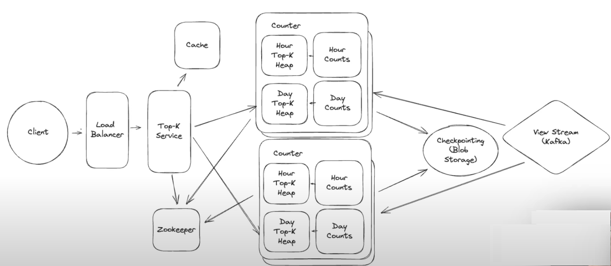

# FR
    Query top-k most viewed videos (1000 videos max for k)
    Accept a parameter which is the time period (min, hour day, all-time)
    Sliding Window
    No arbitary starting point

# NFR
    < 1 min
    10 - 100 ms read latency
    Massive amount of views
    Massive amount of videos
    No approximations
    
# Estimations
100B views/day
100k sec/day
1M views/sec

Uploaded 
1M videos/day
365 days * 10years
3.6 B videos

#### QPS
#### Storage
#### N/w bandwidth

# Entities
    View
        videoId
        window -> min/hour/day/all-time

# APIs
GET /api/v1/videos/views?k={k}&startTime={}&endTime={}

# Design
### Components
1. Client: 
2. API Gateway - LB, Rate Limiting, Routing, Auth, SSl Termination, IP/Domain Whitelisting, CORS, Keep Alive connection
3. Counters Svc (Shard on name) (TopK heap, Counts (Count min-sketch))
4. TopK Svc

### Flow

