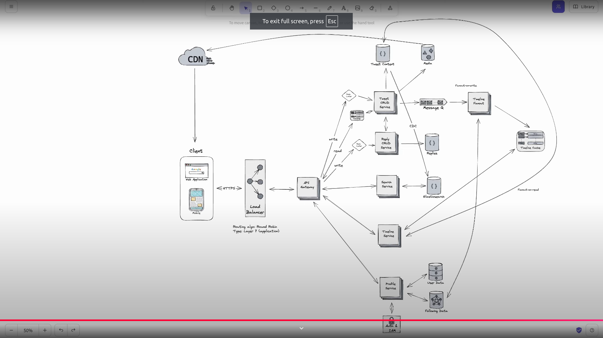

# FR
- Create a/c & login
- CRD tweets
- Follow other users
- View a timeline of tweets from following
- Like, reply, retweet to others tweet
- Search for tweets

# NFR
- Scale to 100+ million requests per second
- Handle high number of tweets, likes and retweets
- Highly Available (99.999% uptime)
- Security & privacy of user data
- Low Latency

# Estimations
## QPS
## Storage
## N/w bandwidth

# Design

# Security
Authentication & Authorization
Encryption
    - HTTPS
    - at rest
Rate Limiting
    - IP rate limiting at gateway
Input Validation
    - at various places in the flow

# Monitoring
Health Checks
- Prometheus, grafana
Logging
- ELK
Alarms
- on metrics to PagerDuty, Slack, Email

# Testing
## Load Testing
to pinpoint bottlenecks
## Automated Testing
for seamless communication given microservices architecture
## Backup & Recovery
- Disaster Recovery
- Redundancy
- Fault Tolerance
