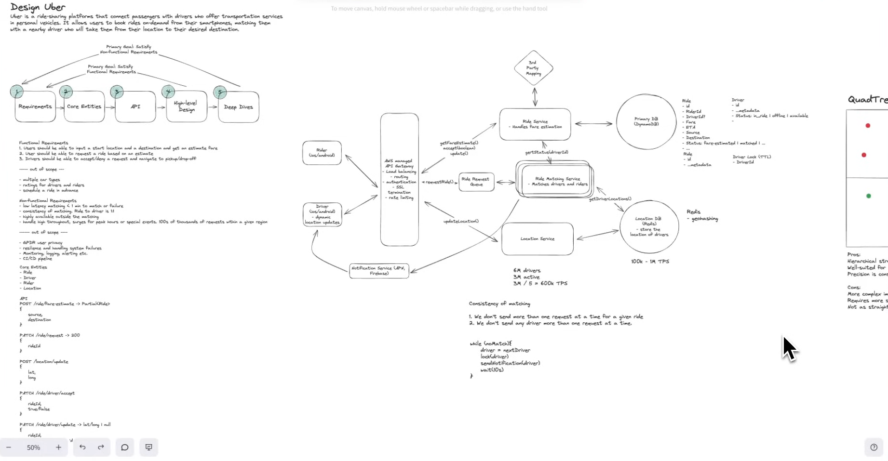

# FR
    User should be able to i/p startLocation & destination and get estimate fare
    User should be able to req a ride based on estimations
    Driver should be able to accept the ride req and navigate to pickup/dropoff

    -- out of scope ----
        - multiple car type
        - ratings for drivers & riders
        - schedule a ride in advance

# NFR
    - Low Latency matching < 1 min to match or failure
    - consistency of matching. ride to driver is 1:1
    - highly availabile outside of matching
    - handle high throughput, surges for peak hours or special events. 100s of thousand req/s within a region
---- out of scope -------
- GDR user privacy
- resilience & handling system failures
- Monitoring, logging, alerting etc.
- CI/CD pipelines


# Estimations
    6M Drivers
    3M active drivers
    3M / 5 = 600K updates every second TPS
### QPS
### Storage
### N/w Bandwidth

# Entities
    Ride
        id
        riderId
        driverId?
        fare
        eta
        source
        destination
        status: fare-estimated
    Driver
        id
        ...metadata
        status: in_ride | offline | available
    Rider
    Location

# API
    POST /api/v1/rides/fares/estimates?source=<>&destination=<> -> Partial<Ride>
    PATCH /api/v1/rides/:rideId/request -> 202, 401, 403, 5xx (As async process)
    POST /api/v1/location
        Request 
        ```json
            {
                lat,
                long
            }
        ```
    PATCH /api/v1/rides/:rideId/drivers/updateStatus
        Request 
        ```json
            {
                status: "accept" | "pickedUp" | "dropoff"
            }
        ```
        Return
        ```json
            {
                lat/long | null
            }
        ```

# Design
## Components
1. Client: Rider, Driver
2. API Gateway - LB, Rate Limiting, Routing, Auth, SSl Termination, IP/Domain Whitelisting, CORS, Keep Alive connection
3. Ride SVC - (3rd party Mapping for ETA, Primary DB (DynamoDB))
4. Ride Matching SVC - (Ride Request Queue (PK - Region/subcity), Location DB, DistributedLock SVC - TTl 5sec, when req sent to driver with Redis/DynamoDB)
5. Location SVC - (Redis - Geo Hashing) / (Bad(Queue, Location DB (PostGIS, Quad Tree), Cons - Reindexing)) - Dynamic (Adaptive) & Batch location update from clients
6. Notification SVC (APN, FCM)

## Consistency of matching
1. We don't send more than 1 req ata a time for a given ride
2. We don't send any driver more than one req at a time
```java
    while (noMatch) {
        driver = nextDriver()
        if (!lock(driver))
            continue
        sendNotification(driver)
        wait(10s)
    }
```

# Flow
