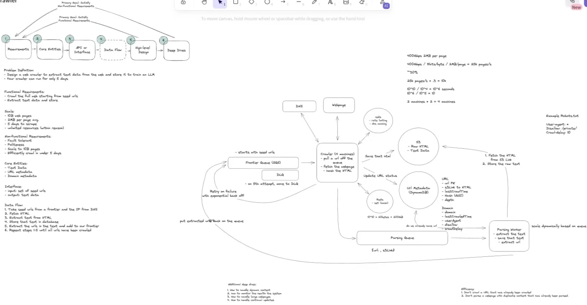

# Problem Definition
    Extract test data from the web & store it to train an LLm
    your crawler can run only for 5 days 

# FR
    Crawl the full web starting from seed urls
    Extract text data and store
### Efficiency
   1. Don't crawl an url that has already been crawled
   2. Don't parse a webpage that has already been parsed

# NFR
    Fault Tolerant
    Politeness (robots.txt)
    Scale to 10B pages
    Efficient crawl under 5 days

# Assumptions
    Web Pages: 10B
    Average Size ~= 2MB per page avg.
    5 days to scrape
    unlimited resources (within reason)

# Estimates
#### QPS
#### Storage
#### N/w bandwidth
400GB per sec n/w bandwidth / 2MB page = 25k pages sec

we can use ~30% of all bandwidth for scraping

## Machines
25k pages per sec * .3 ~= 10K pages second
10B pages / 10K = 10^6 seconds
10^6 / 10^5 seconds in a day = 10 days on 1 machine

2 machines * 2 = ~4 machines to complete in 5 days

# Entities
    TextData
    URLMetadata
      url (PK)
      lastCrawlTime
      checksumOfWebPage (Global Secondary Index)
      depth
      blobId
    DomainMetadata
      domain
      userAgent
      disallowPath
      crawlDelay
      lastCrawlTime
      expiryAt?

# Interface
    - i/p: set of seed urls
    - o/p: text data

# Design
## Flow
1. Take seed urls from a frontier and IP from DNS
2. Fetch HTML
3. Extract text from HTML
4. Store that text in db
5. Extracts the urls in the text & add to our frontier
6. Repeat steps 1 through 5 until all urls have been crawled

### Components
1. Frontier Queue (SQS) (visibility timeout, retry using exponential backoff with 30sec initial and max 5 attempts, DLQ and redrive)
   - starts with seed urls
2. Crawler (S3 HTML Data, UrlMetadata DB [URLMetadata, DomainMetadata](DynamoDB), Redis (Rate Limiter (Sliding Window), ChecksumOfWebPage ))
   - pull url of the queue
   - fetch the webpage
   - extract the text
   - extract the urls
3. DNS Caching, DNS Resolver [Open DNS, ...] (Round Robin b/w multiple dns resolvers)
4. Parsing Queue (html blobId)
5. Parsing Worker
   - extract the text (from DOM)
   - save that text
   - extract text
   - save raw text to s3
   - extract url with depth check
   - put extracted urls back on the queue

### Additional Deep Dives
   1. How to handle dynamic content
   2. Monitoring health of system
   3. How to handle large web pages
   4. How to handle continual updates (URL Scheduler)

# HLD
